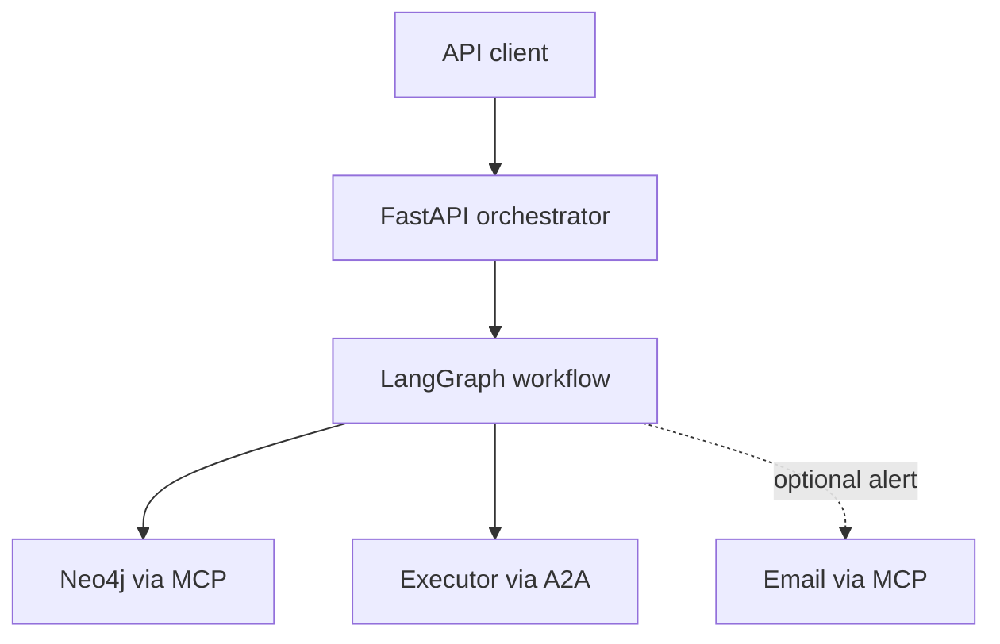

# LLM Agent QoS Orchestrator

A research prototype for closed-loop Quality of Service (QoS) remediation in graph-modeled networks. The system combines a six-stage LangGraph workflow, Neo4j tools exposed through the Model Context Protocol (MCP), and a remote executor exposed through the Agent2Agent (A2A) protocol.

The repository provides two execution modes:

- **Deterministic mode** implements a reproducible, capacity-aware multi-path rebalancing baseline without requiring an LLM.
- **LLM mode** assigns alarm confirmation, pressure analysis, planning, execution, and verification to tool-using agents while preserving the same workflow boundaries.

> This is a research and demonstration system, not a production network controller. Use only with an isolated Neo4j instance and review every write path before connecting it to real infrastructure.

## Highlights

- Six-stage remediation pipeline with explicit early-stop conditions
- Neo4j-backed topology, flow, SLA, path-allocation, and link-load state
- Stepwise multi-path rebalancing with capacity and traffic-conservation checks
- Atomic Neo4j write-back for link loads, path allocations, and flow status
- MCP-based database and optional email tools
- A2A-based separation between orchestration and execution
- Deterministic baseline plus optional OpenAI-compatible or Gemini LLM mode
- Unit tests for planner invariants, candidate metrics, and executor contracts

## Architecture



The workflow is intentionally divided into auditable stages:

| Stage | Responsibility | External capability |
| --- | --- | --- |
| `AlarmIngest` | Create or interpret an incoming QoS alarm | Optional email notification |
| `ConfirmAlarm` | Re-read flow state and evaluate SLA compliance | Neo4j read |
| `AnalyzePressure` | Calculate current allocations and candidate-path metrics | Neo4j read |
| `PlanChange` | Build a capacity-safe rebalance plan | Deterministic planner or LLM |
| `ExecuteChange` | Send the approved plan to the executor | A2A |
| `RegressionVerify` | Apply the atomic graph update and verify the resulting state | Neo4j write and read |

See [docs/architecture.md](docs/architecture.md) for the data model, planner invariants, and trust boundaries.

## Rebalancing model

For an edge with capacity \(C\), current load \(L\), and base latency \(b\), the demonstration queueing model is:

\[
q(C,L)=
\begin{cases}
1000, & L \ge C \\
\frac{10}{C-L}, & L < C
\end{cases}
\qquad
\ell_{edge}=b+q(C,L)
\]

Path latency is the sum of its edge latencies. A flow using multiple paths is assigned the maximum latency among paths with a positive allocation. The deterministic planner moves traffic away from the highest-latency path in fixed increments while enforcing:

- non-negative allocations and edge loads;
- edge load not exceeding capacity;
- conservation of the flow's requested rate;
- post-change bandwidth and latency SLA checks.

## Repository layout

```text
agentic-qos-orchestrator/
├── qos_system_lg/                 # Core orchestration, planning, and protocol clients
│   ├── workflow.py                # LLM workflow and mode dispatcher
│   ├── deterministic_workflow.py  # Deterministic workflow
│   ├── rebalance_planner.py       # Capacity-aware planner and atomic write payload
│   ├── multipath.py               # Network data types and latency calculations
│   └── ...
├── integrations/email_mcp/        # Optional email MCP server
├── scripts/seed_demo.cypher       # Reproducible Neo4j demonstration scenario
├── tests/                         # Unit tests
├── docs/architecture.md           # Detailed design notes
├── compose.yaml                   # Local Neo4j service
├── config.ini                     # Prompts and non-secret application settings
├── mcp.json                       # MCP process definitions; secrets come from the environment
└── pyproject.toml                 # Package metadata and pinned dependencies
```

## Quick start

### 1. Create an environment

Python 3.11 or 3.12 is recommended.

```bash
python -m venv .venv
source .venv/bin/activate
python -m pip install --upgrade pip
python -m pip install -e ".[email]"
```

### 2. Configure local settings

```bash
cp .env.example .env
cp integrations/email_mcp/config.example.ini integrations/email_mcp/config.ini
```

Edit `.env` before starting the services. The deterministic workflow does not need an LLM API key. Email is disabled by default and its local configuration file is ignored by Git.

### 3. Start and seed Neo4j

```bash
set -a
source .env
set +a
docker compose up -d neo4j
docker compose exec -T neo4j \
  cypher-shell -u neo4j -p "$NEO4J_PASSWORD" \
  < scripts/seed_demo.cypher
```

`NEO4J_URL` is consumed by the Neo4j MCP container. The example uses `host.docker.internal`, which is appropriate for Docker Desktop. On a typical Linux Docker bridge, change it to `bolt://172.17.0.1:7687` if needed.

### 4. Start the A2A executor

```bash
uvicorn qos_system_lg.executor_api:app \
  --host 127.0.0.1 \
  --port 8010
```

### 5. Start the orchestrator

In a second terminal with the same environment:

```bash
uvicorn qos_system_lg.orchestrator_api:app \
  --host 127.0.0.1 \
  --port 8000
```

### 6. Run the demonstration

```bash
curl -X POST \
  "http://127.0.0.1:8000/run_demo?scenario=QOS_DEMO&flow_id=FLOW-001"
```

To stream stage-level output:

```bash
curl -N -X POST \
  "http://127.0.0.1:8000/run_demo_stream?scenario=QOS_DEMO&flow_id=FLOW-001&final_json=true"
```

Interactive API documentation is available at `http://127.0.0.1:8000/docs` after startup.

## Execution modes

### Deterministic mode

This is the default and recommended mode for reproducible evaluation:

```dotenv
QOS_WORKFLOW_MODE=deterministic
```

No model API key is required. Candidate analysis, planning, and verification are computed from Neo4j records by Python code.

### LLM mode

Set `QOS_WORKFLOW_MODE=llm` and configure one provider.

OpenAI-compatible example:

```dotenv
QOS_WORKFLOW_MODE=llm
LLM_PROVIDER=openai_compatible
OPENAI_API_KEY=...
OPENAI_MODEL=gpt-4o-mini
OPENAI_BASE_URL=
```

Gemini example:

```dotenv
QOS_WORKFLOW_MODE=llm
LLM_PROVIDER=gemini
GEMINI_API_KEY=...
GEMINI_MODEL=gemini-1.5-flash
```

LLM mode treats a plan as executable only when it explicitly returns `plan_ok: true`. Invalid or unparseable executor responses fail closed.

## Optional email alerts

Email integration is off by default. To enable it:

1. Set `enable_email_on_alarm = true` and a recipient in `config.ini`.
2. Set `MCP_SERVER_NAME=neo4j-cypher,email-mcp` in `.env`.
3. Configure `EMAIL_MCP_ADDRESS` and `EMAIL_MCP_PASSWORD` in `.env`.
4. Review the SMTP/IMAP host settings in `integrations/email_mcp/config.ini`.

Never commit `.env` or `integrations/email_mcp/config.ini`.

## Tests

```bash
python -m unittest discover -s tests -v
```

The test suite covers:

- successful capacity-aware rebalancing;
- atomic write payload construction;
- conservation-preserving allocation normalization;
- candidate edge and bottleneck reporting;
- rejection of paths with missing edge data;
- parsing and fail-closed validation of executor requests;
- explicit plan approval and incomplete-topology rejection.

## Current limitations

- The latency function is a deliberately simple demonstration model, not a calibrated network simulator.
- The executor simulates configuration application; Neo4j is the authoritative demonstration state.
- The default planner assumes reverse edge records mirror physical links when it builds bidirectional load updates.
- The API has no authentication layer and should remain bound to a trusted local interface.
- The LLM path depends on rapidly evolving agent libraries; direct dependencies are pinned to the versions verified with this implementation.
- LLM-mode execution continues to verification only after exactly one A2A call returns a valid `Success` response.

## Responsible use

The repository can issue graph writes and, when enabled, send email. Keep the default integrations disabled until local configuration is complete. Do not connect the prototype to production infrastructure without authentication, authorization, change approval, idempotency controls, persistent audit storage, and rollback validation.
