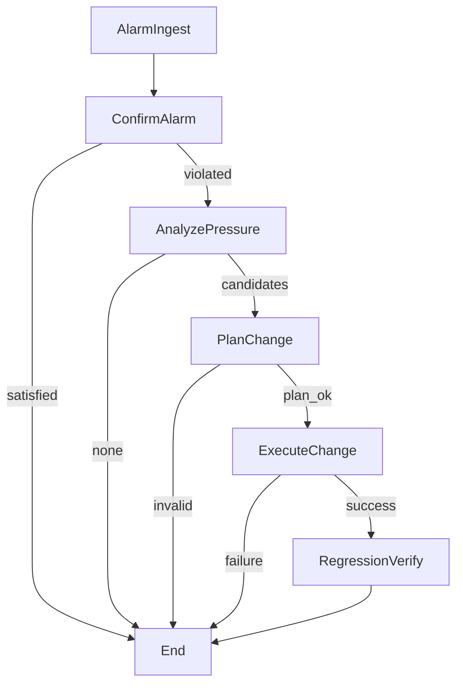

# Architecture and design notes

## Design objective

The system explores whether an agentic workflow can make network remediation steps explicit and auditable while retaining a deterministic baseline. The workflow separates observation, decision, execution, and verification so that each stage can be inspected or replaced independently.

## Component boundaries

| Component | Role | Trust level |
| --- | --- | --- |
| FastAPI orchestrator | Accepts run requests and exposes complete or streamed state | Trusted control plane |
| LangGraph workflow | Enforces stage order and early-stop conditions | Trusted control logic |
| Neo4j MCP server | Reads and writes graph-modeled network state | Privileged tool boundary |
| Email MCP server | Sends optional alarm notifications | Optional privileged integration |
| A2A executor | Validates and simulates execution of an approved plan | Separate execution boundary |
| LLM provider | Produces structured decisions in LLM mode | Untrusted structured-output producer |

## Workflow

The deterministic and LLM workflows share these stage names and state fields. In deterministic mode, Python functions calculate the candidate metrics and plan. In LLM mode, tool-using agents produce strict JSON objects that are merged into workflow state.

## Graph data model

| Entity | Required properties | Purpose |
| --- | --- | --- |
| `Flow` | `flow_id`, `scenario`, `src`, `dst`, `requested_rate`, `sla_min_bw`, `sla_max_latency`, `latency`, `status` | Traffic demand and SLA state |
| `Path` | `id`, `scenario`, `src`, `dst`, `nodes`, `hops` | Ordered candidate route |
| `Device` | `id`, `scenario` | Network endpoint or transit node |
| `USES_PATH` | `rate_mbps` | Flow allocation on a path |
| `CONNECTED_TO` | `capacity`, `load`, `base_latency`, `scenario` | Directed link state |

All read and write queries include the `scenario` field to isolate demonstration datasets.

## Planner invariants

The deterministic planner operates on an immutable flow snapshot and path definitions. Before planning, it checks that:

1. the flow has at least one `USES_PATH` allocation;
2. every allocated path has a definition and edge data;
3. path identifiers are unique;
4. the requested rate is positive;
5. allocation rates sum to the requested rate.

At each iteration, the planner identifies the used path with the largest predicted latency, then selects the feasible alternative path with the lowest predicted latency after adding one traffic step. A move is accepted only when affected link loads remain within `[0, capacity]`.

The resulting plan contains:

- allocations before and after rebalancing;
- per-path rate deltas;
- aggregated per-edge load deltas;
- predicted post-change latency and SLA status;
- a single atomic Cypher write and its parameters;
- a human-readable pseudo-CLI representation.

## Atomic write behavior

The Cypher write performs four operations under one query:

1. match all requested edge updates;
2. validate capacity and non-negative-load constraints;
3. apply edge deltas and replace `USES_PATH` relationships only if validation succeeds;
4. update the `Flow` status and predicted latency.

The verification stage does not trust the plan's prediction. It re-reads flow, allocation, path, and link state and recalculates SLA compliance from the resulting graph snapshot.

## Failure semantics

- Unknown MCP server names raise a configuration error rather than silently selecting another server.
- Empty path definitions are never accepted as zero-latency candidates.
- Plans are sent to the executor only when `plan_ok` is explicitly `true`.
- Missing plan identifiers or CLI configuration invalidate an executor request.
- Malformed or unknown executor statuses are treated as failures.
- Verification runs only after exactly one A2A executor call returns a valid `Success` response.
- Credentials are read from ignored environment or local configuration files, not committed configuration.

## Research extensions

The modular boundaries support several follow-up directions:

- replace the queueing heuristic with measured or learned latency estimates;
- compare deterministic planning with constrained LLM or solver-based planning;
- add counterfactual evaluation before graph mutation;
- introduce persistent event logs and replayable workflow checkpoints;
- add human approval and policy enforcement between planning and execution;
- evaluate robustness under stale or partially missing topology state.
